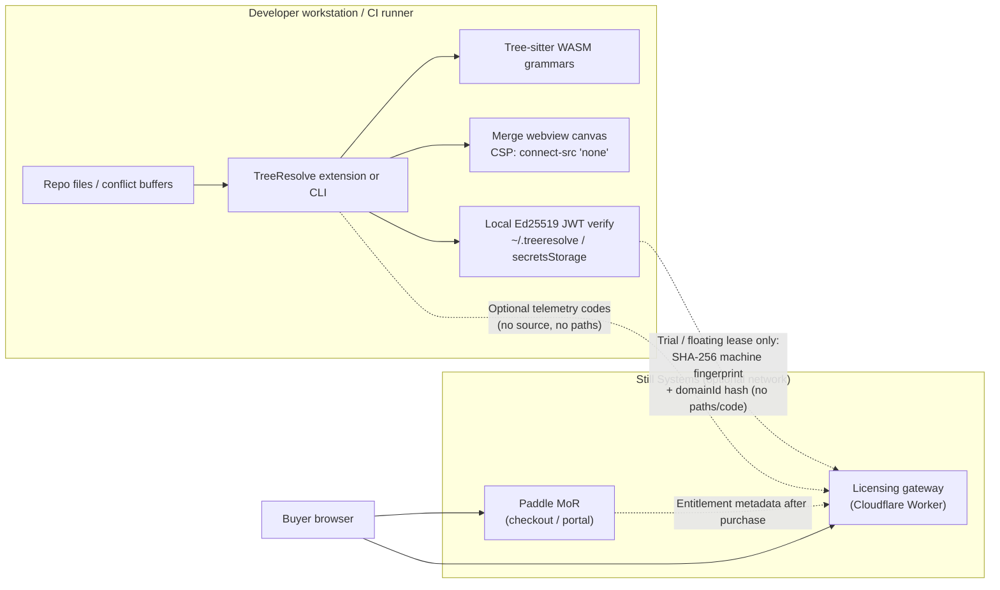

# TreeResolve data-flow diagram

Honest local-first model for InfoSec review. **Customer source code used for
merge resolution never leaves the machine.** Licensing and optional telemetry
are separate, non-code channels.

## Mermaid overview

## What stays local (never transmitted)

| Category | Leaves machine? |
| :--- | :---: |
| Source code, conflict hunks, ASTs/CSTs | **No** |
| File paths, repo URLs, branch/commit names | **No** |
| Webview canvas buffer contents | **No** (CSP blocks outbound `connect-src`) |
| Offline / air-gapped wildcard license validation | **No** (local signature check only) |

## What may leave the machine (non-code)

| Channel | When | Payload (honest) |
| :--- | :--- | :--- |
| Licensing gateway | Reverse trial issuance; floating lease renew/reclaim; revocation manifest fetch when online | Anonymized SHA-256 fingerprint (`platform:arch:machineId`), salted domain id, JWT metadata — **not** source |
| Optional product telemetry | Only if `treeresolve.enableTelemetry` **and** VS Code telemetry enabled | Aggregate codes (e.g. languageId, error codes) — **not** snippets or paths |
| Paddle checkout / portal | Buyer-initiated purchase or billing | Handled by Paddle as Merchant of Record |
| Enterprise inquiry form | Buyer-initiated | Contact fields the buyer submits |

Default licensing endpoint today:
`https://treeresolve-licensing.still-systems.workers.dev`
(launch target: a Still Systems–owned custom host). Enterprises may point
`treeresolve.licensingEndpoint` at an internal reverse proxy, or use offline
wildcard keys and disable telemetry for zero product egress.

## Trust boundaries

1. **Merge plane** — local only. Treat this as the product security claim for
   source-code handling.
2. **License plane** — optional network for trials/leases; offline keys skip it.
3. **Commercial plane** — Paddle and voluntary support/inquiry channels.

For settings and MDM rollout, see [offline-vsix.md](./offline-vsix.md) and
[ENTERPRISE.md](../../ENTERPRISE.md).
